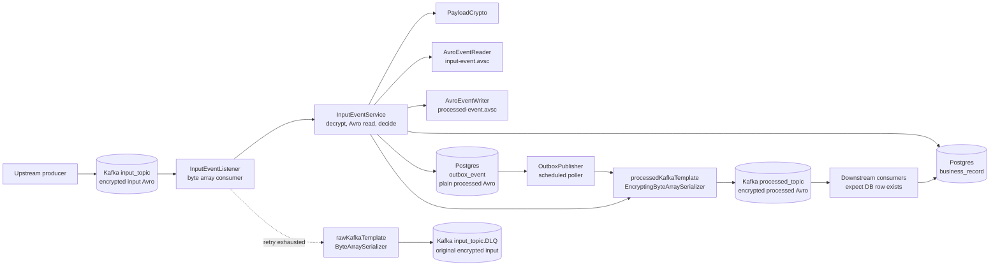
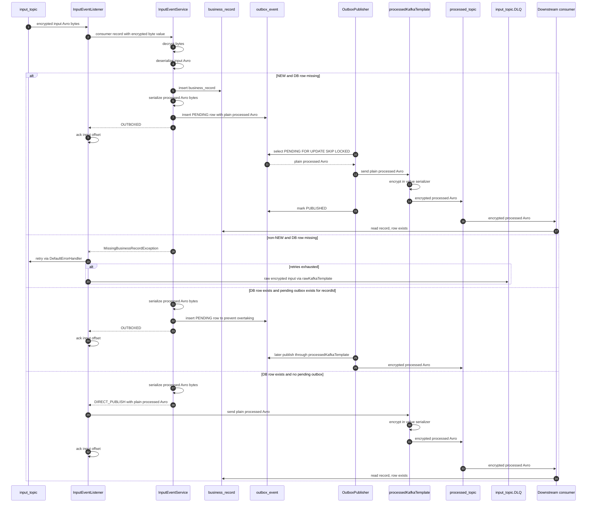

# Kafka MDC Hybrid Outbox Sample

Runnable Spring Boot sample for this flow:

```text
Kafka input_topic encrypted input Avro bytes
  -> MDC RecordInterceptor extracts/generates correlationId
  -> listener decrypts input bytes
  -> listener deserializes plain Avro for business decisions
  -> if NEW and record does not exist: enrich/save DB + save plain output payload to outbox
  -> if non-NEW and record does not exist: retry, then DLQ if the record never appears
  -> if record exists and no pending outbox for same recordId: publish plain output payload with encrypting processed KafkaTemplate
  -> if record exists but pending outbox exists: save plain output payload to outbox to prevent overtaking
  -> outbox publisher publishes stored plain output payload with encrypting processed KafkaTemplate
  -> retries with DefaultErrorHandler
  -> DLQ after retries to input_topic.DLQ
```

The sample consumes and produces `byte[]` because encryption is handled at the Kafka boundary. For local testing:

- `LocalPayloadCrypto` treats payloads as `enc:` + Base64 encoded bytes.
- `AvroEventReader` reads decrypted Apache Avro binary bytes using `src/main/resources/avro/input-event.avsc`.
- `AvroEventWriter` writes Apache Avro binary bytes using `src/main/resources/avro/processed-event.avsc`.
- `processedKafkaTemplate` uses an encrypting value serializer so processed-topic sends are encrypted by producer configuration.
- `rawKafkaTemplate` is kept for DLQ/infrastructure sends so already-encrypted input records are not encrypted a second time.

Replace `LocalPayloadCrypto` with your real decrypt/encrypt implementation. If you use Confluent or Apicurio, adapt the reader/writer so schema-registry wire-format bytes are decrypted before deserialization and encrypted after serialization.

## Component diagram



## Sequence diagram



## Why the hybrid outbox rule exists

This is unsafe:

```text
T1 NEW -> save DB + outbox
T2 UPDATE -> direct publish
```

Because `T2` may reach `processed_topic` before the outbox publisher emits `T1`.

This project uses this rule instead:

```text
if record missing and event is NEW:
  outbox
else if record missing:
  retry, then DLQ
else if pending outbox exists for same recordId:
  outbox
else:
  direct publish
```

That keeps the consumer contract explicit: every event published to `processed_topic` has a committed `business_record` row first. The sample does not guarantee strict event ordering with multiple outbox publisher instances; it guarantees the database row exists before publishing.

## Requirements

- Java 21
- Maven 3.9+
- Docker

## Start infrastructure

```bash
docker compose up -d
```

## Run the app

```bash
mvn spring-boot:run
```

## Create/check topics

Kafka auto-topic creation is enabled for local use, but you can create topics explicitly:

```bash
docker exec -it kafka-mdc-outbox-kafka kafka-topics.sh --bootstrap-server localhost:9092 --create --if-not-exists --topic input_topic --partitions 3 --replication-factor 1

docker exec -it kafka-mdc-outbox-kafka kafka-topics.sh --bootstrap-server localhost:9092 --create --if-not-exists --topic processed_topic --partitions 3 --replication-factor 1

docker exec -it kafka-mdc-outbox-kafka kafka-topics.sh --bootstrap-server localhost:9092 --create --if-not-exists --topic input_topic.DLQ --partitions 3 --replication-factor 1
```

## Send test events

Use the same key for the same record to preserve ordering per recordId.

Terminal 1: consume processed topic:

```bash
docker exec -it kafka-mdc-outbox-kafka kafka-console-consumer.sh \
  --bootstrap-server localhost:9092 \
  --topic processed_topic \
  --from-beginning \
  --property print.key=true \
  --property key.separator=' | '
```

Terminal 2: produce input events:

```bash
docker exec -i kafka-mdc-outbox-kafka kafka-console-producer.sh \
  --bootstrap-server localhost:9092 \
  --topic input_topic \
  --property parse.key=true \
  --property key.separator='|' <<EOF2
R1|enc:BFIxAApGaXJzdA==
R1|enc:BFIxAgxTZWNvbmQ=
R1|enc:BFIxAgpUaGlyZA==
EOF2
```

Those local sample payloads are `enc:` + Base64 encoded Avro binary bytes generated from `input-event.avsc`.

Expected behavior:

```text
T1 NEW -> outbox because DB record is missing
T2 UPDATE -> outbox if T1 outbox is still pending
T3 UPDATE -> direct publish only if no pending outbox remains
```

Because the local outbox publisher runs every second, depending on timing, T2/T3 may go direct or via outbox. The important rule is that direct publishing is blocked while pending outbox exists for the same record.

## Check database

```bash
docker exec -it kafka-mdc-outbox-postgres psql -U outboxuser -d outboxdb
```

```sql
select * from business_record;
select record_id, event_key, source_partition, source_offset, status, encode(payload_bytes, 'base64') as plain_output_avro_base64, created_at, published_at from outbox_event order by created_at;
```

## Clean design notes

- `config` contains Spring/Kafka wiring only.
- `listener` is thin: calls application service, direct-publishes only when told to, then acks.
- `application` contains orchestration/use-case logic.
- `record` contains the business DB entity/repository.
- `outbox` contains outbox persistence and header serialization.
- `crypto` isolates Kafka-boundary encryption/decryption.
- `avro` isolates input decoding and output encoding from `.avsc` specifications.
- producer encryption is scoped to the processed producer template; DLQ publishing uses the raw producer template.
- MDC is set at the Kafka boundary and restored in the outbox publisher when processing stored rows.
- The listener only acknowledges after DB transaction and direct publish have completed.
- non-`NEW` events for missing records are retried and eventually sent to DLQ instead of being published without a database row.

## Production improvements to consider

- Add schema registry support if using Confluent or Apicurio wire format.
- Replace `LocalPayloadCrypto` with authenticated encryption, key management, and failure handling that match your platform.
- Use a bounded retry policy for outbox publishing with max attempts and an outbox DLQ table.
- Keep outbox publisher single-threaded initially if strict order matters globally.
- For higher throughput, shard outbox workers by `recordId` while ensuring the same `recordId` is never processed concurrently.
- Add Micrometer metrics for listener retries, DLQ sends, outbox pending count, publish latency, and failure count.
